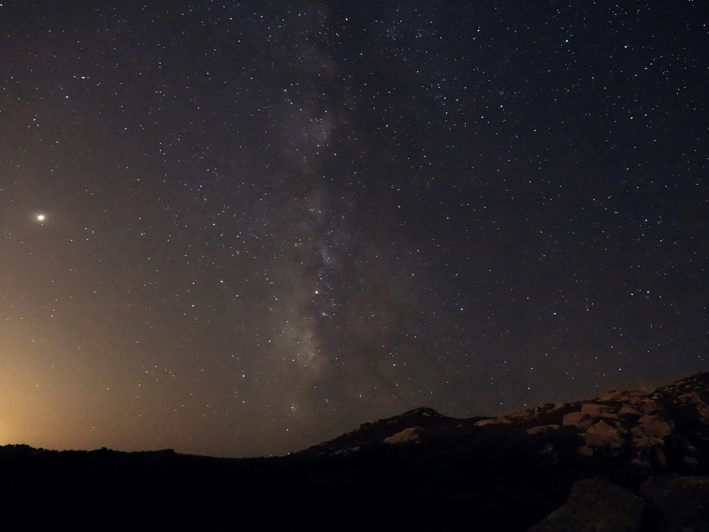
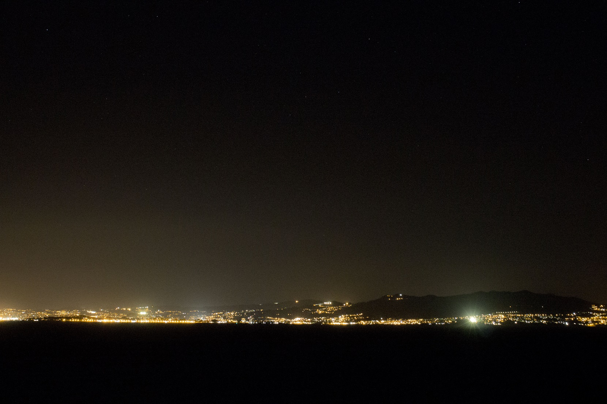
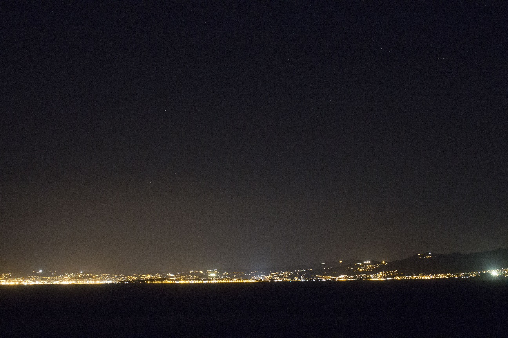
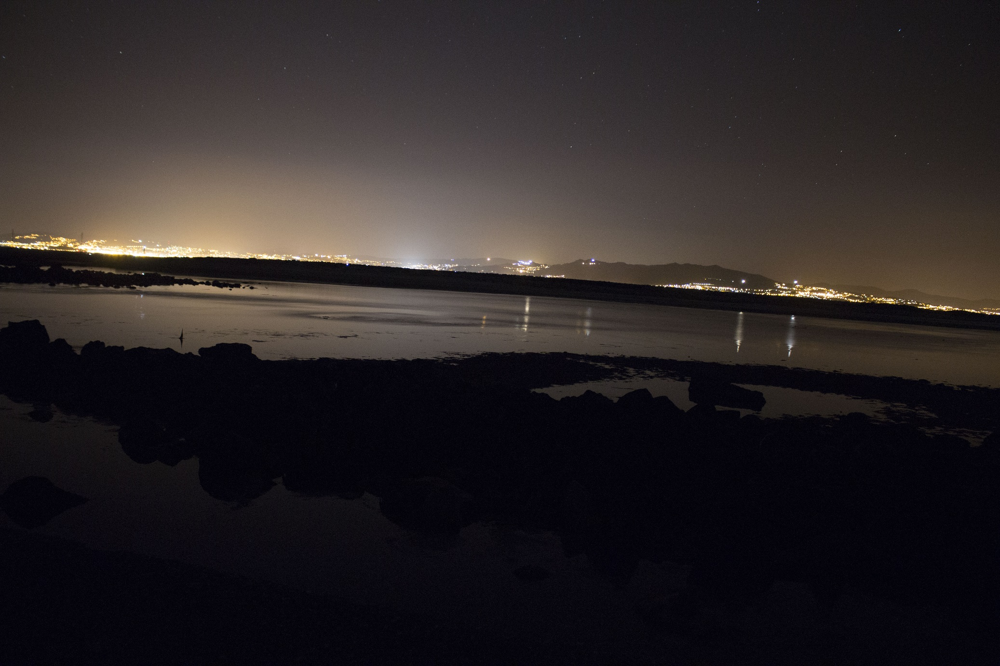

Las luces de Vigo proyectan mucha contaminacion luminica sobre las Islas Cies.

Vigo visto desde cies, se aprecia el alto nivel de contaminación que proyecta.
Vista desde Vieira, Cies.

Vista desde el dique de Cies
